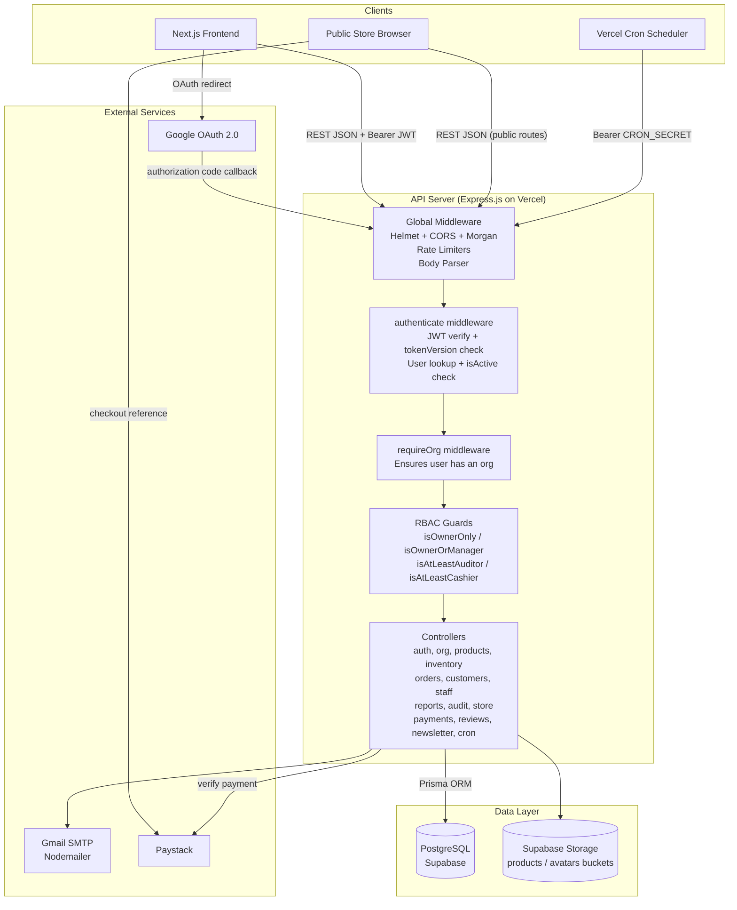
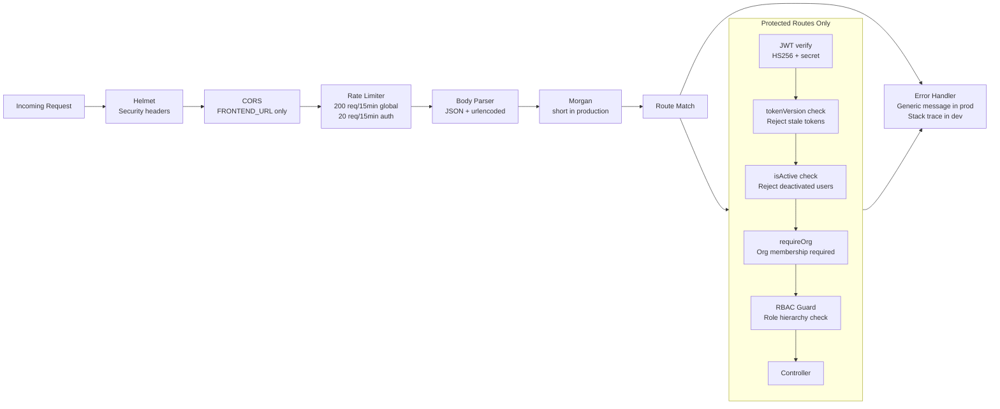
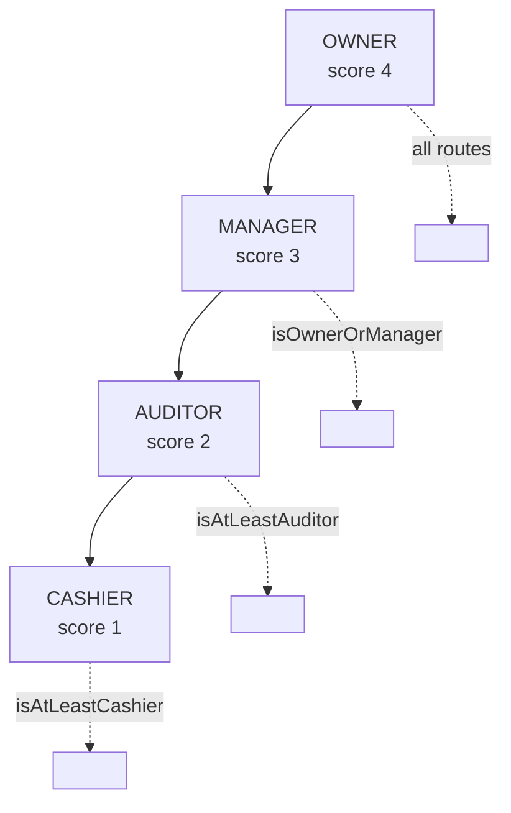
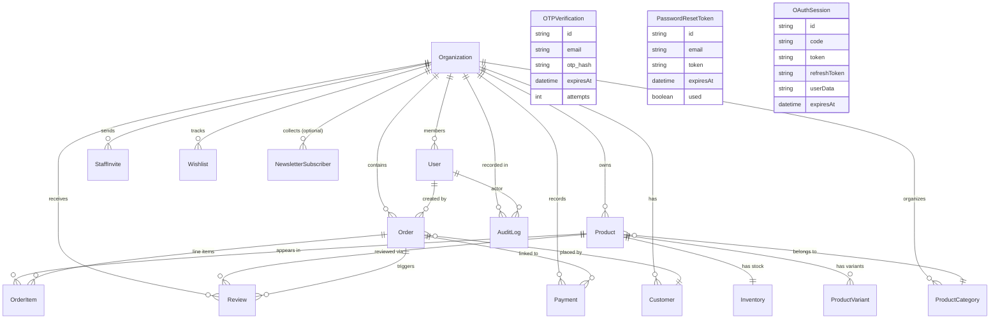

<div align="center">

# Traqify API

**Express.js REST API for the Traqify multi-tenant store management platform.**

[](https://nodejs.org)
[](https://www.typescriptlang.org)
[](https://expressjs.com)
[](https://www.prisma.io)
[](https://supabase.com)
[](https://vercel.com)

Live API: **[https://traqify-api.vercel.app](https://traqify-api.vercel.app)**

</div>

---

## What this is

The Traqify API is a RESTful JSON service built with Express.js and TypeScript. It handles all business logic for the platform: multi-tenant organization management, product catalogues, POS order creation, inventory control, customer records, staff access management, public storefronts with Paystack checkout, financial reports, review moderation, newsletter management, and a complete audit trail.

All deployment targets are Vercel serverless functions. The database is PostgreSQL hosted on Supabase, accessed through Prisma ORM.

---

## Table of Contents

1. [Architecture](#architecture)
2. [Folder Structure](#folder-structure)
3. [Middleware Pipeline](#middleware-pipeline)
4. [RBAC System](#rbac-system)
5. [API Reference](#api-reference)
6. [Database Models](#database-models)
7. [Email Templates](#email-templates)
8. [File Uploads](#file-uploads)
9. [Environment Variables](#environment-variables)
10. [Local Development](#local-development)
11. [Deployment](#deployment)

---

## Architecture



---

## Folder Structure

```
backend/
  prisma/
    schema.prisma          Prisma data model (17 models)
    migrations/            SQL migration history
  src/
    config/
      database.ts          Prisma client singleton
      email.ts             Nodemailer transport configuration
      supabase.ts          Supabase Storage admin client + uploadFile helper
    controllers/
      audit.controller.ts  Paginated audit log queries and mark-read
      auth.controller.ts   Registration, OTP, login, OAuth, tokens, password
      category.controller.ts Product category CRUD
      cron.controller.ts   Keep-alive ping for Supabase
      customer.controller.ts Customer CRUD
      inventory.controller.ts Stock levels and low-stock alerts
      newsletter.controller.ts Subscribe and org-scoped subscriber management
      order.controller.ts  POS order creation, status transitions, downloads
      org.controller.ts    Organization create/read/update, public store info
      payment.controller.ts Payment record CRUD
      product.controller.ts Product CRUD with variant and inventory support
      report.controller.ts Overview stats, sales, top products, PDF/email reports
      review.controller.ts Public review submission and dashboard moderation
      staff.controller.ts  Invite, manage, deactivate, and remove staff
      store.controller.ts  Public storefront, Paystack checkout, wishlist
    emails/
      templates.ts         All branded HTML email templates
    middleware/
      auth.middleware.ts   JWT verification + tokenVersion + isActive check
      error.middleware.ts  notFound handler + global error formatter
      rbac.middleware.ts   Role hierarchy guards
      upload.middleware.ts Multer memory storage with MIME allowlist
    routes/
      audit.routes.ts
      auth.routes.ts
      category.routes.ts
      cron.routes.ts
      customer.routes.ts
      inventory.routes.ts
      newsletter.routes.ts
      order.routes.ts
      org.routes.ts
      payment.routes.ts
      product.routes.ts
      report.routes.ts
      review.routes.ts
      staff.routes.ts
      store.routes.ts
    utils/
      audit.ts             createAuditLog helper
      jwt.ts               signToken, verifyToken, signRefreshToken, verifyRefreshToken
      otp.ts               OTP generation, SHA-256 hashing, storage, brute-force guard
      slug.ts              Unique slug generator for organizations
      validators.ts        All Zod request schemas
    index.ts               App bootstrap, route registration, wishlist cron, Paystack webhook
  vercel.json              Serverless function config and daily cron schedule
  .env.example             Required environment variable reference
```

---

## Middleware Pipeline

Every request passes through the global middleware stack before reaching route handlers. Protected routes then pass through authentication and role guards.



---

## RBAC System

Four roles with a numeric hierarchy. The hierarchy is used by guards: a guard requiring score N allows any role with score >= N.

| Role    | Score | Capabilities |
|---------|-------|-------------|
| OWNER   | 4     | Full access to everything |
| MANAGER | 3     | Products, inventory, orders, customers, staff invites, reports |
| AUDITOR | 2     | Read-only access to all data, audit logs, financial reports |
| CASHIER | 1     | Create orders, manage customers, view own orders |

Named guards:

| Guard              | Minimum score | Allowed roles |
|--------------------|---------------|---------------|
| `isOwnerOnly`      | 4             | OWNER |
| `isOwnerOrManager` | 3             | OWNER, MANAGER |
| `isAtLeastAuditor` | 2             | OWNER, MANAGER, AUDITOR |
| `isAtLeastCashier` | 1             | All authenticated org members |

Role hierarchy diagram:



---

## API Reference

Base URL: `https://traqify-api.vercel.app`

### Authentication (`/api/auth`)

| Method | Path | Guard | Description |
|--------|------|-------|-------------|
| POST | `/api/auth/send-otp` | public | Send a 6-digit OTP to an email address |
| POST | `/api/auth/verify-email` | public | Verify OTP and mark email as verified |
| POST | `/api/auth/register` | public | Create account (email must be pre-verified) |
| POST | `/api/auth/check-email` | public | Check if an email is already registered |
| POST | `/api/auth/login` | public | Authenticate and receive access + refresh tokens |
| GET | `/api/auth/google-redirect` | public | Initiate Google OAuth 2.0 flow |
| GET | `/api/auth/google-callback` | public | Google OAuth callback; stores tokens in OAuthSession |
| GET | `/api/auth/oauth-exchange/:code` | public | Exchange a one-time OAuth code for tokens |
| POST | `/api/auth/forgot-password` | public | Request a password reset link by email |
| POST | `/api/auth/reset-password` | public | Complete password reset with token |
| POST | `/api/auth/refresh` | public | Get a new access token using a refresh token |
| POST | `/api/auth/accept-invite` | public | Accept a staff invitation and create account |
| GET | `/api/auth/me` | authenticate | Get the current user's profile |
| PATCH | `/api/auth/me` | authenticate | Update name, phone, bio |
| POST | `/api/auth/change-password` | authenticate | Change password (increments tokenVersion) |
| POST | `/api/auth/logout` | authenticate | Invalidate all sessions (increments tokenVersion) |
| POST | `/api/auth/upload-avatar` | authenticate | Upload a profile photo to Supabase Storage |

### Organizations (`/api/orgs`)

| Method | Path | Guard | Description |
|--------|------|-------|-------------|
| POST | `/api/orgs` | authenticate | Create an organization; requester becomes OWNER |
| GET | `/api/orgs/:slug` | authenticate + requireOrg | Get organization details and counts |
| PATCH | `/api/orgs/:slug` | isOwnerOnly | Update organization settings |
| GET | `/api/orgs/:slug/store` | public | Get public store info (used by org.controller) |
| POST | `/api/orgs/:slug/upload-logo` | isOwnerOnly | Upload organization logo |

### Products (`/api/products`)

| Method | Path | Guard | Description |
|--------|------|-------|-------------|
| GET | `/api/products` | authenticate + requireOrg | List all products for the org |
| GET | `/api/products/:id` | authenticate + requireOrg | Get a single product with variants and inventory |
| POST | `/api/products` | isOwnerOrManager | Create a product |
| PATCH | `/api/products/:id` | isOwnerOrManager | Update a product |
| DELETE | `/api/products/:id` | isOwnerOrManager | Delete a product |
| POST | `/api/products/upload-image` | isOwnerOrManager | Upload a product image (JPEG/PNG/WebP, max 5 MB) |
| POST | `/api/products/upload-file` | isOwnerOrManager | Upload a downloadable product file (max 4 MB) |

### Inventory (`/api/inventory`)

| Method | Path | Guard | Description |
|--------|------|-------|-------------|
| GET | `/api/inventory` | authenticate + requireOrg | List all inventory records |
| GET | `/api/inventory/low-stock` | authenticate + requireOrg | Products below their low-stock threshold |
| PATCH | `/api/inventory/:productId` | isOwnerOrManager | Update stock quantity |

### Categories (`/api/categories`)

| Method | Path | Guard | Description |
|--------|------|-------|-------------|
| GET | `/api/categories` | authenticate + requireOrg | List categories for the org |
| POST | `/api/categories` | isOwnerOrManager | Create a category |
| PATCH | `/api/categories/:id` | isOwnerOrManager | Update a category |
| DELETE | `/api/categories/:id` | isOwnerOrManager | Delete a category |

### Orders (`/api/orders`)

| Method | Path | Guard | Description |
|--------|------|-------|-------------|
| GET | `/api/orders` | authenticate + requireOrg | List orders (CASHIER sees own orders only) |
| GET | `/api/orders/:id` | authenticate + requireOrg | Get a single order with items |
| POST | `/api/orders` | isAtLeastCashier | Create a POS order; decrements inventory |
| PATCH | `/api/orders/:id/status` | isOwnerOrManager | Update order status |
| DELETE | `/api/orders/:id` | isOwnerOrManager | Delete an order |

### Customers (`/api/customers`)

| Method | Path | Guard | Description |
|--------|------|-------|-------------|
| GET | `/api/customers` | authenticate + requireOrg | List customers |
| GET | `/api/customers/:id` | authenticate + requireOrg | Get a customer with order history |
| POST | `/api/customers` | authenticate + requireOrg | Create a customer record |
| PATCH | `/api/customers/:id` | authenticate + requireOrg | Update a customer |
| DELETE | `/api/customers/:id` | isOwnerOrManager | Delete a customer |

### Staff (`/api/staff`)

| Method | Path | Guard | Description |
|--------|------|-------|-------------|
| GET | `/api/staff/invite/:token` | public | Validate a staff invite token |
| GET | `/api/staff` | isAtLeastAuditor | List all staff members |
| GET | `/api/staff/invites` | isOwnerOrManager | List pending invitations |
| DELETE | `/api/staff/invites/:inviteId` | isOwnerOrManager | Cancel a pending invite |
| POST | `/api/staff/invite` | isOwnerOrManager | Send a staff invitation email |
| PATCH | `/api/staff/:userId/role` | isOwnerOnly | Change a staff member's role |
| PATCH | `/api/staff/:userId/access` | isOwnerOrManager | Activate or deactivate a staff account |
| DELETE | `/api/staff/:userId` | isOwnerOnly | Remove a staff member |
| POST | `/api/staff/:userId/reset-password` | isOwnerOrManager | Force a password reset for a staff member |

### Payments (`/api/payments`)

| Method | Path | Guard | Description |
|--------|------|-------|-------------|
| GET | `/api/payments` | isAtLeastAuditor | List payment records for the org |
| GET | `/api/payments/:id` | isAtLeastAuditor | Get a single payment record |
| POST | `/api/payments` | isOwnerOrManager | Create a payment record |
| PATCH | `/api/payments/:id` | isOwnerOrManager | Update a payment record |

### Reports (`/api/reports`)

| Method | Path | Guard | Description |
|--------|------|-------|-------------|
| GET | `/api/reports/overview` | isAtLeastAuditor | Dashboard stats: revenue, orders, customers, stock |
| GET | `/api/reports/sales` | isAtLeastAuditor | Sales report with date range filter |
| GET | `/api/reports/top-products` | isAtLeastAuditor | Top selling products |
| GET | `/api/reports/revenue-chart` | isAtLeastAuditor | Revenue data for chart by period |
| GET | `/api/reports/customer-chart` | isAtLeastAuditor | New customer acquisition chart data |
| GET | `/api/reports/:type/pdf` | isAtLeastAuditor | Download a report as PDF |
| POST | `/api/reports/:type/email` | isAtLeastAuditor | Email a report to the requester |

### Audit Logs (`/api/audit-logs`)

| Method | Path | Guard | Description |
|--------|------|-------|-------------|
| GET | `/api/audit-logs` | isAtLeastAuditor | Paginated audit log with filters |
| GET | `/api/audit-logs/unread-count` | isAtLeastAuditor | Count of unread audit events |
| PATCH | `/api/audit-logs/mark-read` | isOwnerOrManager | Mark one or many logs as read |
| GET | `/api/audit-logs/:id` | isAtLeastAuditor | Get a single audit log entry |

### Reviews (`/api/reviews`)

| Method | Path | Guard | Description |
|--------|------|-------|-------------|
| POST | `/api/reviews` | public | Submit a product review (requires valid orderId + productId) |
| GET | `/api/reviews/product/:productId` | public | List approved reviews for a product |
| GET | `/api/reviews` | isOwnerOrManager | Paginated dashboard review list with status filter |
| PATCH | `/api/reviews/:id/moderate` | isOwnerOrManager | Approve or reject a review |
| DELETE | `/api/reviews/:id` | isOwnerOrManager | Delete a review |

### Newsletter (`/api/newsletter`)

| Method | Path | Guard | Description |
|--------|------|-------|-------------|
| POST | `/api/newsletter/subscribe` | public | Subscribe to the platform newsletter |
| GET | `/api/newsletter/subscribers` | isOwnerOrManager | List subscribers scoped to the requesting org |
| DELETE | `/api/newsletter/:id` | isOwnerOrManager | Remove a subscriber (org-scoped) |

### Public Store (`/api/store`)

| Method | Path | Guard | Description |
|--------|------|-------|-------------|
| GET | `/api/store/:slug` | public | Get published products and org info for a store |
| POST | `/api/store/:slug/checkout` | public | Place an order with optional Paystack payment |
| POST | `/api/store/:slug/wishlist` | public | Save a wishlist for abandoned cart emails |

### Cron (`/api/cron`)

| Method | Path | Guard | Description |
|--------|------|-------|-------------|
| GET | `/api/cron/ping` | CRON_SECRET bearer | Keep the Supabase database active |

---

## Database Models

All 17 models defined in `prisma/schema.prisma`:



---

## Email Templates

All templates live in `src/emails/templates.ts` and produce branded HTML. Templates in use:

| Template | Trigger |
|----------|---------|
| `otpEmailTemplate` | Email verification during registration or resend |
| `passwordResetEmailTemplate` | Forgot password request |
| `passwordChangedEmailTemplate` | Successful password change or reset |
| `welcomeEmailTemplate` | Organization created |
| `staffInviteEmailTemplate` | Staff invitation sent |
| `newStaffJoinedEmailTemplate` | Staff member accepted an invite |
| `storeStatusEmailTemplate` | Store published or taken offline |
| `orderConfirmationEmailTemplate` | Order status update to APPROVED |
| `orderCompletedEmailTemplate` | Order status update to COMPLETED (attaches downloadables) |
| `abandonedCartEmailTemplate` | Wishlist follow-up at 30 min / 2 hr / 1 day / 3 days |

---

## File Uploads

Uploads are handled by `multer` with `memoryStorage`. Files are never written to disk.

| Route | Bucket | MIME allowlist | Max size |
|-------|--------|---------------|---------|
| `POST /api/auth/upload-avatar` | `avatars` | JPEG, PNG, WebP | 5 MB |
| `POST /api/orgs/:slug/upload-logo` | `avatars` | JPEG, PNG, WebP | 5 MB |
| `POST /api/products/upload-image` | `products` | JPEG, PNG, WebP | 5 MB |
| `POST /api/products/upload-file` | `downloadables` | PDF, ZIP, Office, images, audio, video | 4 MB |

After validation the file buffer is passed to `uploadFile()` in `src/config/supabase.ts`, which uploads it to the appropriate Supabase Storage bucket and returns a public URL.

---

## Environment Variables

Copy `.env.example` to `.env` and fill in every value before starting the server. The process throws at startup if any required variable is missing.

| Variable | Description |
|----------|-------------|
| `DATABASE_URL` | Supabase transaction pooler URL (PgBouncer, port 6543) |
| `DIRECT_URL` | Supabase direct connection URL (port 5432, used for migrations) |
| `PORT` | HTTP port (default: 5000) |
| `NODE_ENV` | `development` or `production` |
| `API_URL` | This server's base URL |
| `FRONTEND_URL` | Frontend origin for CORS and email links |
| `JWT_SECRET` | Access token signing secret (generate: `openssl rand -base64 64`) |
| `JWT_REFRESH_SECRET` | Refresh token signing secret |
| `JWT_EXPIRES_IN` | Access token TTL (default: `7d`) |
| `SUPABASE_URL` | Supabase project URL |
| `SUPABASE_ANON_KEY` | Supabase anon key |
| `SUPABASE_SERVICE_ROLE_KEY` | Supabase service role key (for Storage writes) |
| `SMTP_HOST` | SMTP hostname (default: `smtp.gmail.com`) |
| `SMTP_PORT` | SMTP port (default: `587`) |
| `SMTP_USER` | Gmail address |
| `SMTP_PASS` | Gmail app password |
| `SMTP_FROM` | From address for outgoing email |
| `GOOGLE_CLIENT_ID` | Google OAuth 2.0 client ID |
| `GOOGLE_CLIENT_SECRET` | Google OAuth 2.0 client secret |
| `PAYSTACK_SECRET_KEY` | Paystack secret key (sk_live_... or sk_test_...) |
| `PAYSTACK_PUBLIC_KEY` | Paystack public key |
| `CRON_SECRET` | Secret Vercel injects for cron job authentication |

---

## Local Development

```bash
# 1. Install dependencies
npm install

# 2. Set up environment
cp .env.example .env
# Edit .env with real credentials

# 3. Apply database migrations
npx prisma migrate dev

# 4. Start the development server
npm run dev
# API available at http://localhost:5000
```

Other useful commands:

```bash
npm run build          # Compile TypeScript to dist/
npx prisma studio      # Open Prisma Studio at http://localhost:5555
npx prisma migrate dev --name <name>   # Create a new migration
npx prisma generate    # Regenerate Prisma Client after schema changes
```

---

## Deployment

The backend deploys as a Vercel serverless function.

`vercel.json` configures:

- The function entry point at `dist/index.js`
- Route rewrites to capture all paths under `/api/*`
- A daily cron job at `0 6 * * *` (UTC) targeting `GET /api/cron/ping`

Required Vercel environment variables mirror `.env.example`. Set them in Vercel project settings under Environment Variables. The `CRON_SECRET` must not contain leading or trailing whitespace.

To trigger a redeployment from the command line:

```bash
git commit --allow-empty -m "chore: trigger redeploy"
git push origin main
```
