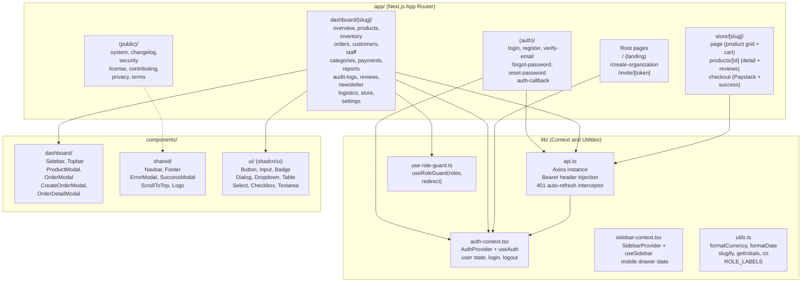
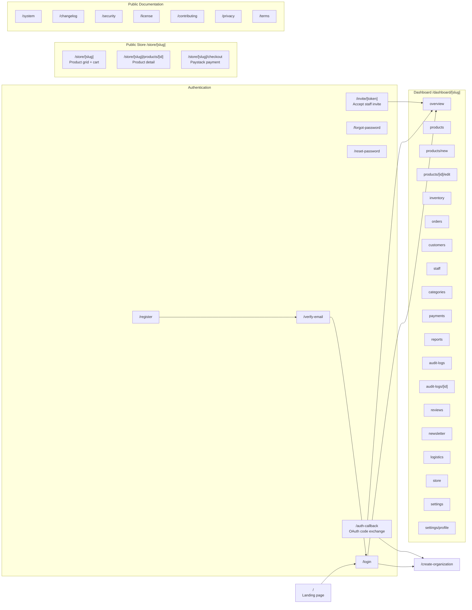
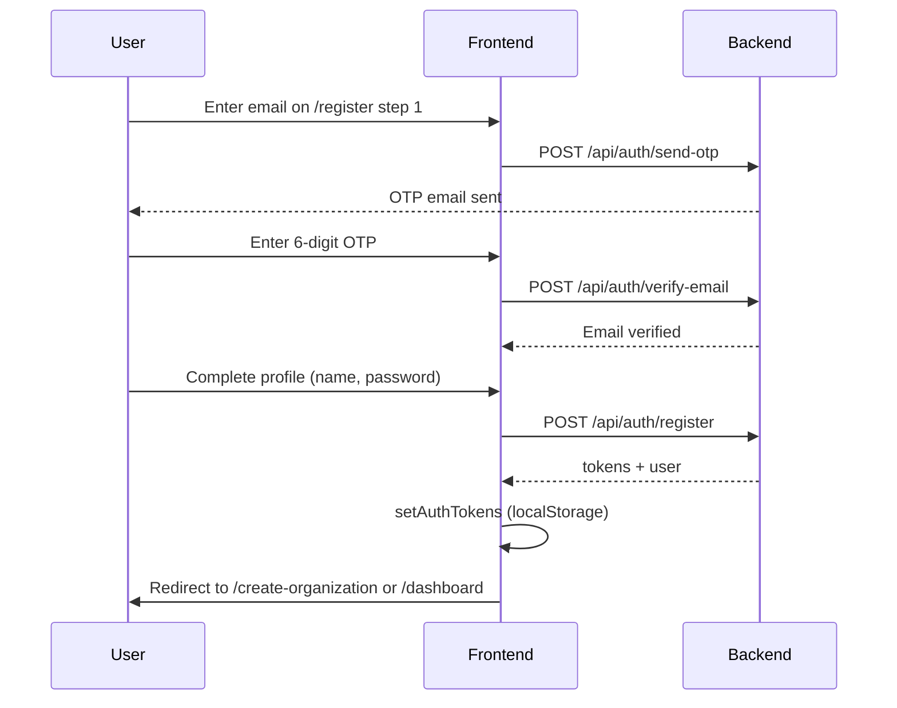
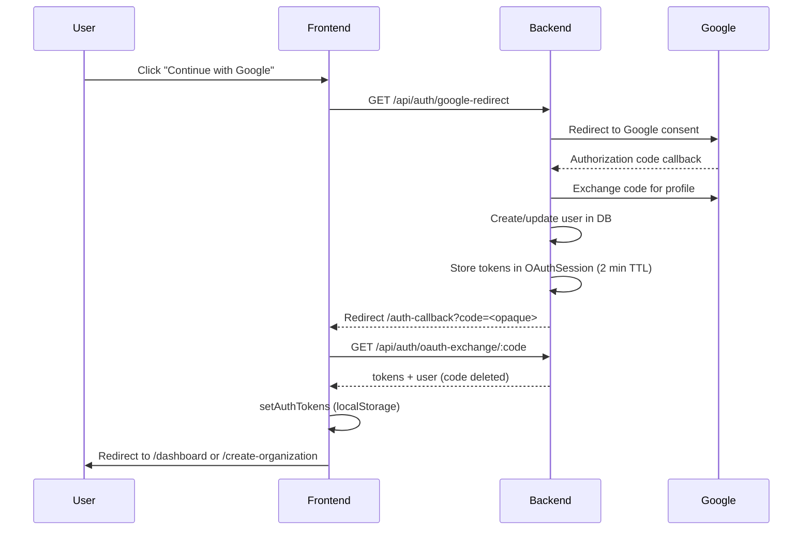
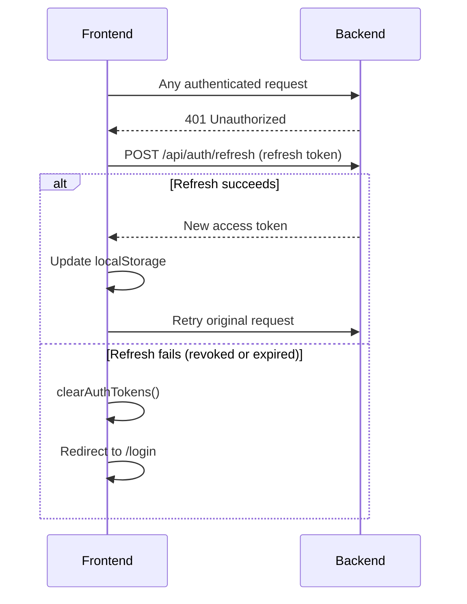
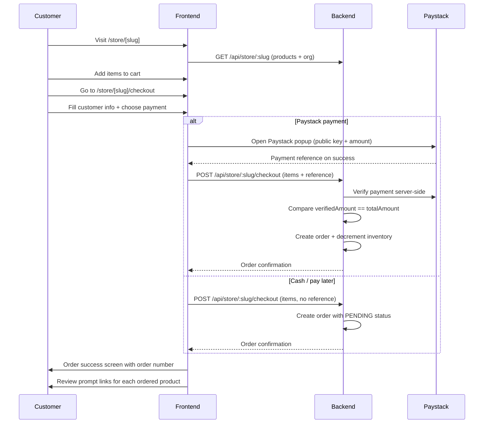

<div align="center">

# Traqify Frontend

**Next.js 14 App Router frontend for the Traqify multi-tenant store management platform.**

[](https://nextjs.org)
[](https://www.typescriptlang.org)
[](https://tailwindcss.com)
[](https://www.framer.com/motion)
[](https://recharts.org)
[](https://vercel.com)

Live: **[https://traqify.vercel.app](https://traqify.vercel.app)**

</div>

---

## What this is

The Traqify frontend is a client-rendered Next.js 14 application using the App Router. It covers three distinct surfaces:

- **Dashboard**: a full per-organization back-office for OWNER, MANAGER, AUDITOR, and CASHIER roles.
- **Public store**: a customer-facing storefront at `/store/[slug]` with product browsing, a cart, Paystack checkout, and review prompts.
- **Public documentation pages**: static content at `/system`, `/changelog`, `/security`, `/license`, `/contributing`, `/privacy`, and `/terms`.

All data fetching goes through the Axios instance in `lib/api.ts`, which automatically attaches `Authorization: Bearer <token>` headers and refreshes expired access tokens.

---

## Table of Contents

1. [Component Architecture](#component-architecture)
2. [Folder Structure](#folder-structure)
3. [Route Map](#route-map)
4. [Authentication Flows](#authentication-flows)
5. [RBAC on the Frontend](#rbac-on-the-frontend)
6. [State Management](#state-management)
7. [Shared Utilities](#shared-utilities)
8. [Public Store Flow](#public-store-flow)
9. [Environment Variables](#environment-variables)
10. [Local Development](#local-development)
11. [Deployment](#deployment)

---

## Component Architecture



---

## Folder Structure

```
frontend/
  app/
    (auth)/
      auth-callback/        Exchanges OAuth one-time code for tokens
      forgot-password/      Password reset request form
      layout.tsx            Minimal layout for auth pages
      login/                Email + password login form
      register/             Multi-step OTP-first registration
      reset-password/       Set new password with token
      verify-email/         OTP entry after registration
    (public)/
      changelog/            Platform changelog
      contributing/         Contribution guide
      layout.tsx            Shared layout for public doc pages
      license/              License text
      privacy/              Privacy policy
      security/             Security disclosure information
      system/               Architecture and system documentation
      terms/                Terms of service
    create-organization/    Step after first login: create an org
    dashboard/
      [slug]/
        audit-logs/         Immutable action history with detail view
        categories/         Product category management
        customers/          Customer list and detail modal
        inventory/          Stock levels and low-stock alerts
        layout.tsx          Dashboard shell: Sidebar + Topbar + role gate
        logistics/          Delivery zone configuration
        newsletter/         Org-scoped subscriber list and CSV export
        orders/             POS order list with status management
        overview/           Revenue + customer charts, stats cards
        page.tsx            Redirect to /overview
        payments/           Payment record list and creation
        products/           Product grid with new/edit forms
        reports/            PDF and email report generation
        reviews/            Approve, reject, and delete customer reviews
        settings/           Profile, organization, and password tabs
        staff/              Staff list, invite, deactivate, and remove
        store/              Storefront publish toggle and settings
    invite/
      [token]/              Accept a staff invitation and set up account
    store/
      [slug]/
        checkout/           Cart review, Paystack payment, order success
        page.tsx            Product grid, search, cart drawer, wishlist
        products/
          [id]/             Product detail page with approved reviews
    globals.css
    icon.svg
    layout.tsx              Root layout: AuthProvider, SidebarProvider, fonts
    not-found.tsx           Global 404 page
    page.tsx                Landing page
  components/
    dashboard/
      create-order-modal.tsx  POS order creation dialog
      order-detail-modal.tsx  Order detail view with status controls
      product-modal.tsx       Product detail / quick-view dialog
      sidebar.tsx             Responsive sidebar with per-role nav items
      topbar.tsx              Dashboard topbar with user menu
    shared/
      error-modal.tsx         Reusable error dialog
      footer.tsx              Site-wide footer with nav links
      logo.tsx                Traqify logotype component
      navbar.tsx              Landing page + public docs navbar (white on doc pages)
      scroll-to-top.tsx       Floating scroll-to-top button
    ui/                       shadcn/ui primitives
  hooks/                      Custom React hooks
  lib/
    api.ts                    Axios instance + token helpers + interceptor
    auth-context.tsx          AuthProvider, useAuth, user state, logout
    sidebar-context.tsx       SidebarProvider, useSidebar
    supabase.ts               Supabase browser client (for Storage URLs)
    use-role-guard.ts         useRoleGuard hook for page-level role blocking
    utils.ts                  formatCurrency, formatDate, slugify, cn, getInitials, ROLE_LABELS
  public/                     Static assets
  next.config.mjs
  tailwind.config.ts
  tsconfig.json
```

---

## Route Map



---

## Authentication Flows

### Email Registration (OTP-first)



### Google OAuth



### Token Refresh

The Axios response interceptor in `lib/api.ts` automatically handles expired access tokens:



---

## RBAC on the Frontend

The server is the authoritative access control layer. Frontend RBAC controls navigation visibility and page routing only.

### `useRoleGuard`

`lib/use-role-guard.ts` exports `useRoleGuard(allowedRoles, redirectTo)`. Each dashboard page that is restricted to specific roles calls this hook. If the authenticated user's role is not in `allowedRoles`, the hook triggers `router.replace(redirectTo)` before the page renders.

### Sidebar Navigation by Role

The `Sidebar` component reads the user's role and filters the `navItems` array to show only the pages the role can access.

| Page | OWNER | MANAGER | AUDITOR | CASHIER |
|------|-------|---------|---------|---------|
| Overview | Yes | Yes | Yes | Yes |
| Products | Yes | Yes | Yes | Yes |
| Inventory | Yes | Yes | Yes | Yes |
| Orders | Yes | Yes | Yes | Yes |
| Customers | Yes | Yes | Yes | Yes |
| Staff | Yes | Yes | No | No |
| Categories | Yes | Yes | No | No |
| Payments | Yes | Yes | Yes | No |
| Reports | Yes | Yes | Yes | No |
| Reviews | Yes | Yes | No | No |
| Newsletter | Yes | Yes | No | No |
| Logistics | Yes | Yes | No | No |
| Store | Yes | Yes | No | No |
| Audit Logs | Yes | No | Yes | No |
| Settings | Yes | Yes | Yes | Yes |

---

## State Management

The application uses React Context for shared state. There is no external state library.

### `AuthContext` (`lib/auth-context.tsx`)

Provides:

| Export | Type | Description |
|--------|------|-------------|
| `user` | `User \| null` | Currently authenticated user object |
| `isLoading` | `boolean` | True while the initial auth check runs |
| `setUser` | `(u: User) => void` | Update user state after profile edit |
| `logout` | `() => void` | Calls `POST /api/auth/logout`, clears localStorage, redirects to `/login` |

On mount, `AuthProvider` reads `traqify_user` from `localStorage` to rehydrate the user without a network round trip.

### `SidebarContext` (`lib/sidebar-context.tsx`)

Manages the mobile sidebar drawer open/close state. Consumed by `Sidebar` and `Topbar`.

### Token Helpers (`lib/api.ts`)

| Function | Description |
|----------|-------------|
| `setAuthTokens(token, refresh, user)` | Persist all three values to `localStorage` |
| `clearAuthTokens()` | Remove all auth keys from `localStorage` |
| `getAccessToken()` | Read the access token from `localStorage` |

---

## Shared Utilities

All utilities live in `lib/utils.ts`:

| Function | Description |
|----------|-------------|
| `cn(...inputs)` | Merge Tailwind classes (clsx + tailwind-merge) |
| `formatCurrency(amount, currency)` | Format as NGN currency by default using `Intl.NumberFormat` |
| `formatDate(date)` | Format as "15 Jun 2025" |
| `formatDateTime(date)` | Format as "15 Jun 2025, 14:30" |
| `slugify(text)` | Convert text to a URL-safe slug |
| `getInitials(name)` | Extract up to 2 initials from a name |
| `ROLE_LABELS` | Map from role enum to display label (e.g. `OWNER -> "Owner"`) |

---

## Public Store Flow



---

## Environment Variables

Create `.env.local` at the root of this directory:

```
NEXT_PUBLIC_API_URL=https://traqify-api.vercel.app
NEXT_PUBLIC_PAYSTACK_PUBLIC_KEY=pk_live_...
```

| Variable | Description |
|----------|-------------|
| `NEXT_PUBLIC_API_URL` | Backend API base URL (no trailing slash) |
| `NEXT_PUBLIC_PAYSTACK_PUBLIC_KEY` | Paystack public key for the payment popup |

---

## Local Development

```bash
# 1. Install dependencies
npm install

# 2. Set up environment
cp .env.local.example .env.local
# Edit .env.local with local API URL and Paystack test key

# 3. Start the development server
npm run dev
# Frontend available at http://localhost:3000
```

Other useful commands:

```bash
npm run build     # Production build with type checking
npm run lint      # ESLint check
```

The development server connects to whatever `NEXT_PUBLIC_API_URL` points at. Point it at `http://localhost:5000` to run fully locally against a local API instance, or leave it pointing at the production API for frontend-only work.

---

## Deployment

The frontend deploys as a Next.js application on Vercel.

The App Router produces a mix of statically prerendered pages (landing, public docs) and dynamically rendered pages (dashboard, store). Vercel handles routing automatically.

Required Vercel environment variables:

- `NEXT_PUBLIC_API_URL` - set to the production API URL
- `NEXT_PUBLIC_PAYSTACK_PUBLIC_KEY` - set to the live key in production or the test key in preview environments

The navbar applies a white background immediately (without scroll) on the public documentation pages (`/system`, `/changelog`, `/security`, `/license`, `/contributing`, `/privacy`, `/terms`). On all other pages the navbar transitions to white on scroll. This is controlled by `WHITE_BG_PATHS` in `components/shared/navbar.tsx`.
